<!-- marketplace-omit-start -->
<p align="center">
  
</p>

<h1 align="center">Ether Themes</h1>

<p align="center">
  <strong>25 dark color themes · 496 web-dev snippets · Astro, Vue, Svelte, MDX &amp; Android grammars</strong><br />
  One extension for <strong>VS Code</strong> and <strong>Cursor</strong> — WCAG-validated palettes, zero extra setup.
</p>

<p align="center">
  <a href="https://marketplace.visualstudio.com/items?itemName=Priyaank.ether-theme"></a>
  <a href="https://open-vsx.org/extension/Priyaank/ether-theme"></a>
  <a href="https://open-vsx.org/extension/Priyaank/ether-theme"></a>
  <a href="https://github.com/PRIYAANK2510/ether-theme/blob/main/LICENSE"></a>
</p>

<p align="center">
  <a href="https://marketplace.visualstudio.com/items?itemName=Priyaank.ether-theme"><strong>Install on VS Code</strong></a>
  &nbsp;·&nbsp;
  <a href="https://open-vsx.org/extension/Priyaank/ether-theme"><strong>Install on Cursor</strong></a>
  &nbsp;·&nbsp;
  <a href="https://PRIYAANK2510.github.io/ether-theme/"><strong>Website</strong></a>
  &nbsp;·&nbsp;
  <a href="https://PRIYAANK2510.github.io/ether-theme/snippets/"><strong>Snippet Documentation</strong></a>
  &nbsp;·&nbsp;
  <a href="https://github.com/PRIYAANK2510/ether-theme"><strong>GitHub</strong></a>
  &nbsp;·&nbsp;
  <a href="CHANGELOG.md"><strong>Changelog</strong></a>
</p>
<!-- marketplace-omit-end -->

---

## Install

1. Open **Extensions** (`Ctrl+Shift+X` / `Cmd+Shift+X`)
2. Search **`Ether Themes`**
3. Click **Install**, then pick a palette: **`Ctrl+K Ctrl+T`** (Windows/Linux) or **`Cmd+K Cmd+T`** (macOS)

Or run in the command palette:

```
ext install Priyaank.ether-theme
```

## Why developers pick Ether

- **25 dark themes** — Curated distinct palettes: neutral Graphite, cool Storm and Slate, bioluminescent Abyss, matrix Cipher, volcanic Magma, and more
- **496 snippets** — React 19, Next.js App Router, TanStack Query, Zod, Vitest, Node/Express — type a prefix, press Tab
- **Bundled grammars** — Astro, Vue, Svelte, MDX, Angular templates, Kotlin, AIDL, ProGuard/R8, and Dotenv — no extra language extensions required
- **Readable by design** — WCAG contrast checks at build time; comments tuned to match active gutter line numbers
- **Works everywhere** — Published on the VS Code Marketplace and Open VSX for Cursor

## Theme catalog

Ether Abyss · Ether Amethyst · Ether Cipher · Ether Dracula · Ether Dusk · Ether Ember · Ether Graphite · Ether Luna · Ether Magma · Ether Midnight · Ether Moss · Ether Noir · Ether Obsidian · Ether Slate · Ether Stone · Ether Storm

## Previews

<!-- PREVIEW_GALLERY_START -->
<div style="display:flex;flex-wrap:wrap;justify-content:center;align-items:flex-start;column-gap:48px;row-gap:0;max-width:100%">
<div style="flex:0 1 420px;max-width:100%;box-sizing:border-box;margin:0 0 64px">
<p style="margin:0 0 10px;text-align:left;line-height:1.45">
<strong>Ether Abyss</strong>
</p>
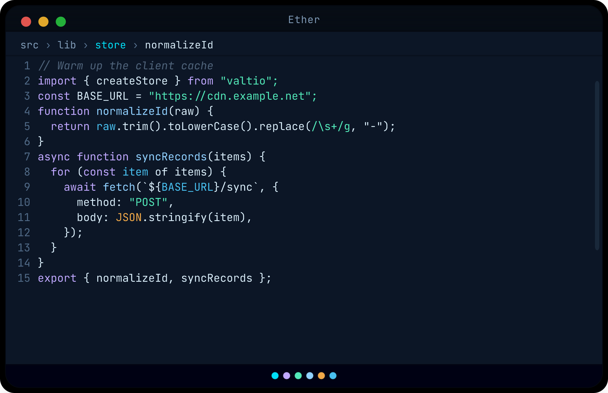
</div>
<div style="flex:0 1 420px;max-width:100%;box-sizing:border-box;margin:0 0 64px">
<p style="margin:0 0 10px;text-align:left;line-height:1.45">
<strong>Ether Amethyst</strong>
</p>
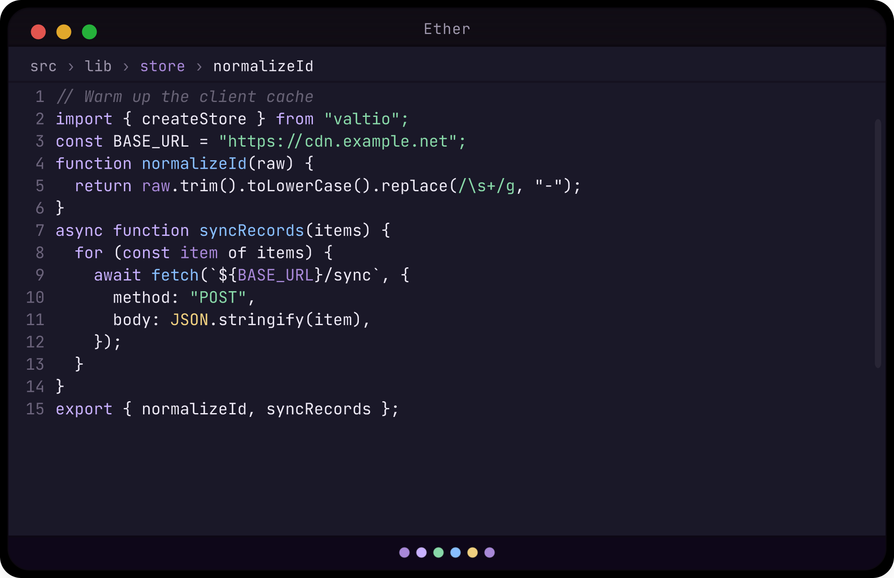
</div>
<div style="flex:0 1 420px;max-width:100%;box-sizing:border-box;margin:0 0 64px">
<p style="margin:0 0 10px;text-align:left;line-height:1.45">
<strong>Ether Arctic</strong>
</p>
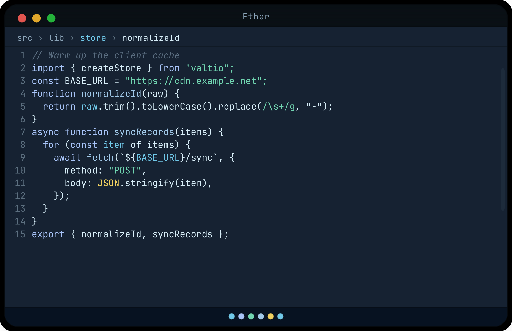
</div>
<div style="flex:0 1 420px;max-width:100%;box-sizing:border-box;margin:0 0 64px">
<p style="margin:0 0 10px;text-align:left;line-height:1.45">
<strong>Ether Celestial</strong>
</p>
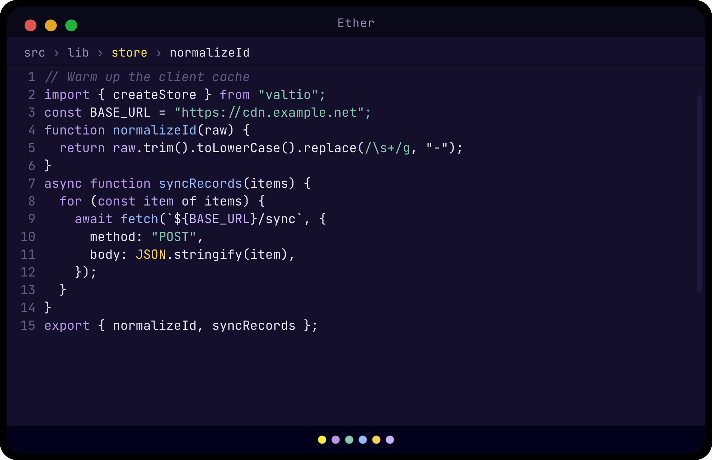
</div>
<div style="flex:0 1 420px;max-width:100%;box-sizing:border-box;margin:0 0 64px">
<p style="margin:0 0 10px;text-align:left;line-height:1.45">
<strong>Ether Cipher</strong>
</p>
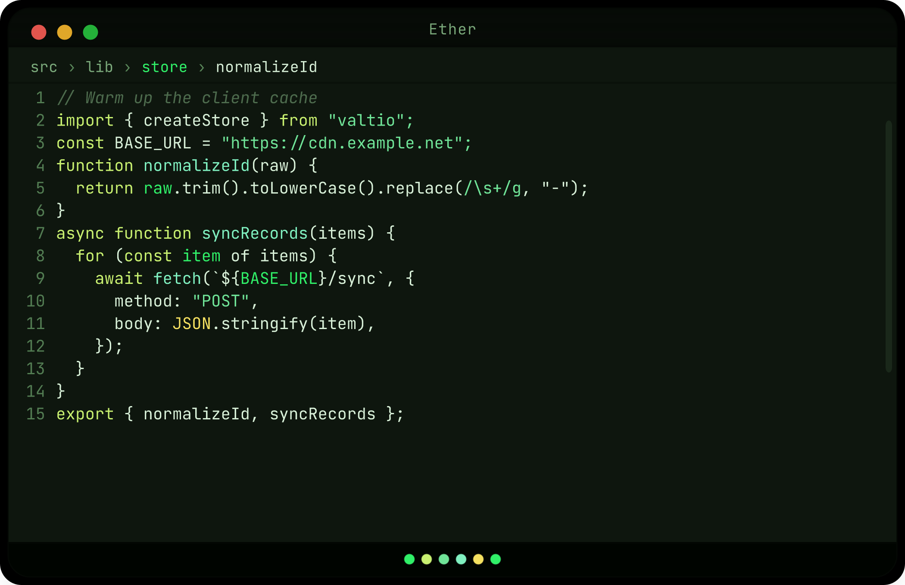
</div>
<div style="flex:0 1 420px;max-width:100%;box-sizing:border-box;margin:0 0 64px">
<p style="margin:0 0 10px;text-align:left;line-height:1.45">
<strong>Ether Crimson</strong>
</p>
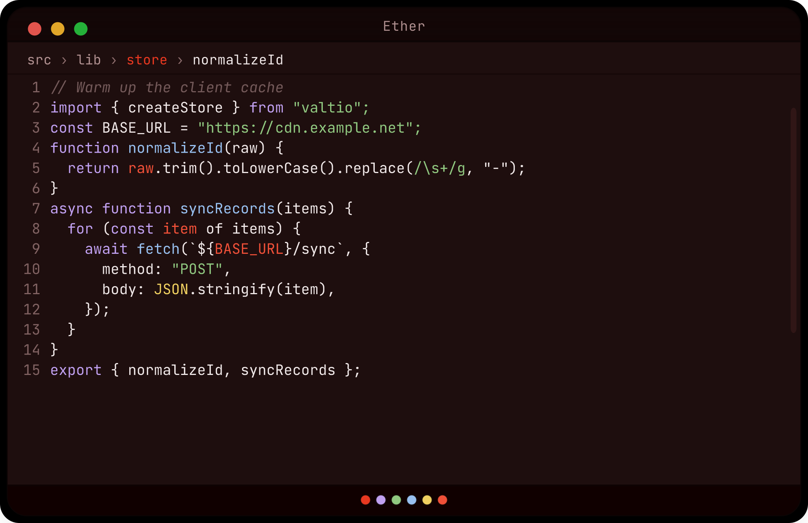
</div>
<div style="flex:0 1 420px;max-width:100%;box-sizing:border-box;margin:0 0 64px">
<p style="margin:0 0 10px;text-align:left;line-height:1.45">
<strong>Ether Cyber</strong>
</p>
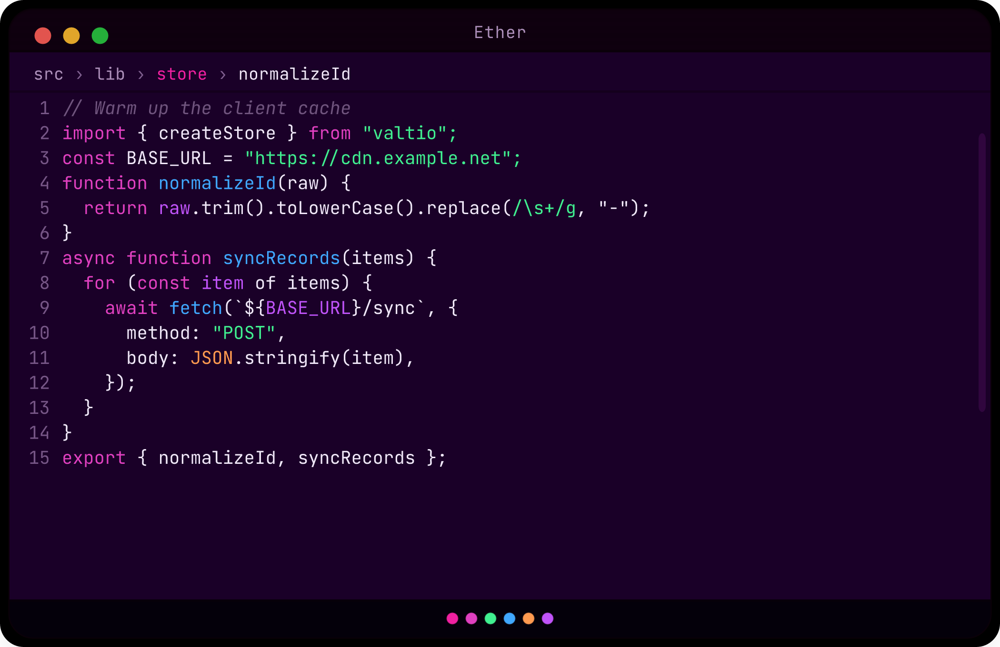
</div>
<div style="flex:0 1 420px;max-width:100%;box-sizing:border-box;margin:0 0 64px">
<p style="margin:0 0 10px;text-align:left;line-height:1.45">
<strong>Ether Dracula</strong>
</p>

</div>
<div style="flex:0 1 420px;max-width:100%;box-sizing:border-box;margin:0 0 64px">
<p style="margin:0 0 10px;text-align:left;line-height:1.45">
<strong>Ether Dusk</strong>
</p>

</div>
<div style="flex:0 1 420px;max-width:100%;box-sizing:border-box;margin:0 0 64px">
<p style="margin:0 0 10px;text-align:left;line-height:1.45">
<strong>Ether Ember</strong>
</p>

</div>
<div style="flex:0 1 420px;max-width:100%;box-sizing:border-box;margin:0 0 64px">
<p style="margin:0 0 10px;text-align:left;line-height:1.45">
<strong>Ether Forest</strong>
</p>
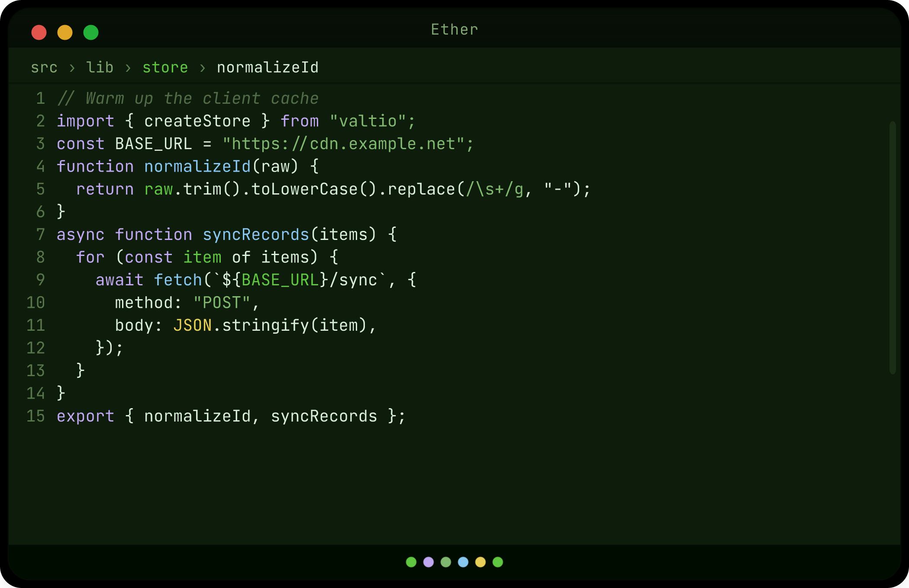
</div>
<div style="flex:0 1 420px;max-width:100%;box-sizing:border-box;margin:0 0 64px">
<p style="margin:0 0 10px;text-align:left;line-height:1.45">
<strong>Ether Graphite</strong>
</p>

</div>
<div style="flex:0 1 420px;max-width:100%;box-sizing:border-box;margin:0 0 64px">
<p style="margin:0 0 10px;text-align:left;line-height:1.45">
<strong>Ether Luna</strong>
</p>

</div>
<div style="flex:0 1 420px;max-width:100%;box-sizing:border-box;margin:0 0 64px">
<p style="margin:0 0 10px;text-align:left;line-height:1.45">
<strong>Ether Magma</strong>
</p>
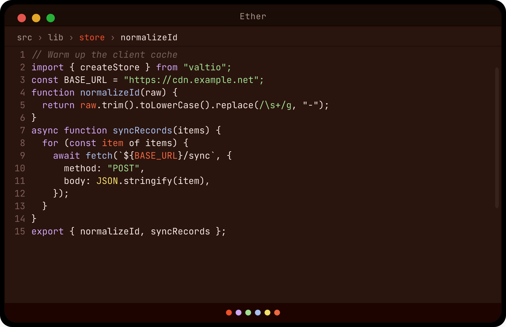
</div>
<div style="flex:0 1 420px;max-width:100%;box-sizing:border-box;margin:0 0 64px">
<p style="margin:0 0 10px;text-align:left;line-height:1.45">
<strong>Ether Midnight</strong>
</p>
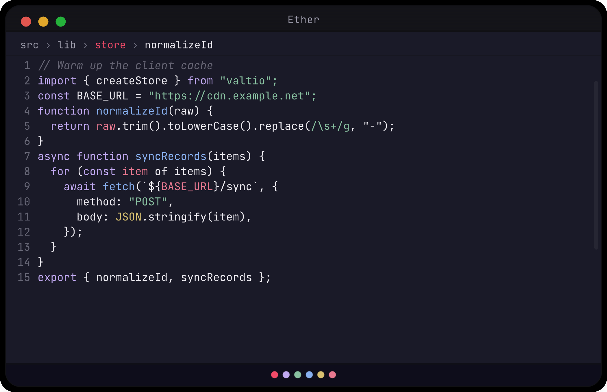
</div>
<div style="flex:0 1 420px;max-width:100%;box-sizing:border-box;margin:0 0 64px">
<p style="margin:0 0 10px;text-align:left;line-height:1.45">
<strong>Ether Moss</strong>
</p>

</div>
<div style="flex:0 1 420px;max-width:100%;box-sizing:border-box;margin:0 0 64px">
<p style="margin:0 0 10px;text-align:left;line-height:1.45">
<strong>Ether Noir</strong>
</p>

</div>
<div style="flex:0 1 420px;max-width:100%;box-sizing:border-box;margin:0 0 64px">
<p style="margin:0 0 10px;text-align:left;line-height:1.45">
<strong>Ether Obsidian</strong>
</p>
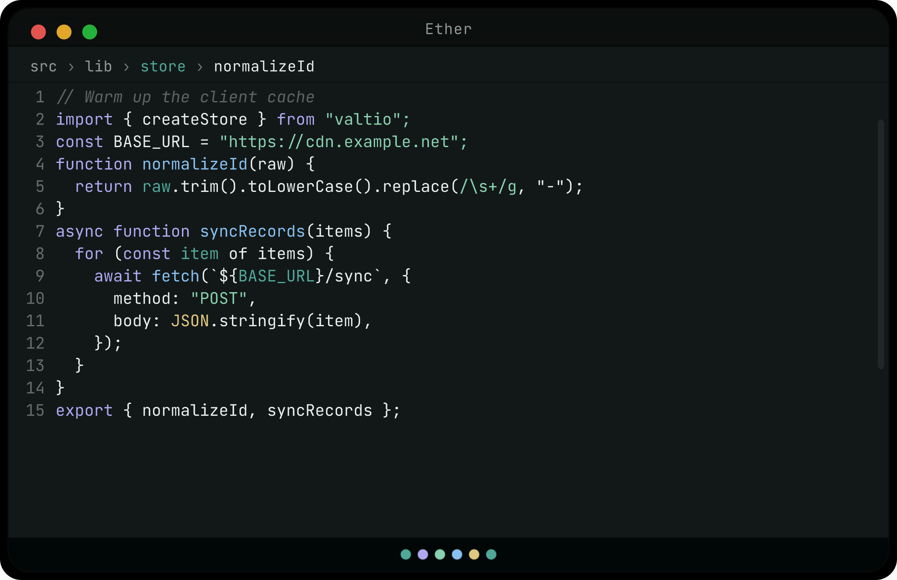
</div>
<div style="flex:0 1 420px;max-width:100%;box-sizing:border-box;margin:0 0 64px">
<p style="margin:0 0 10px;text-align:left;line-height:1.45">
<strong>Ether Rust</strong>
</p>
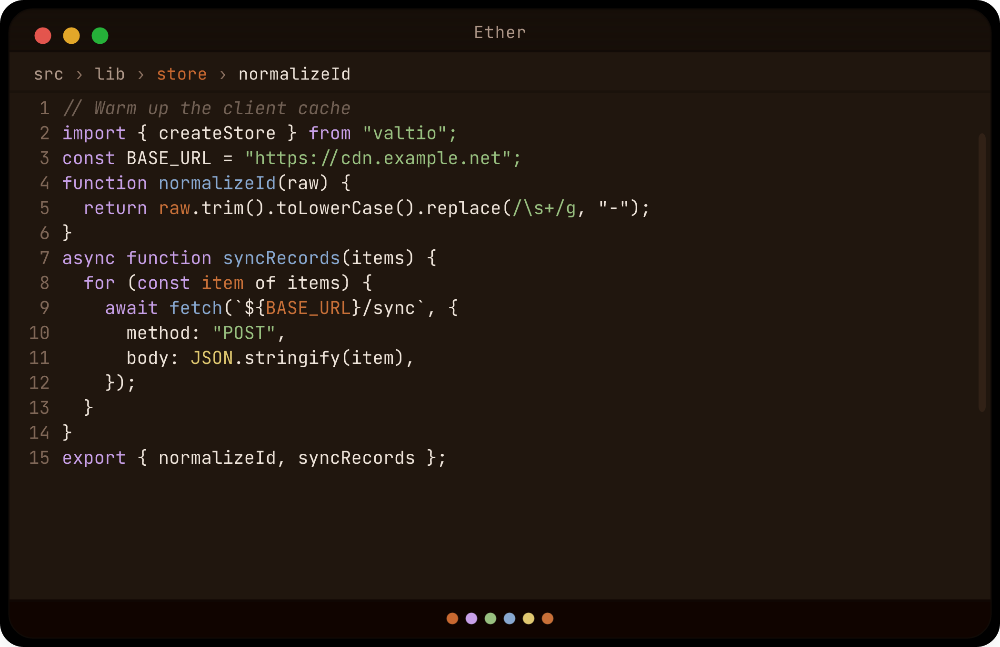
</div>
<div style="flex:0 1 420px;max-width:100%;box-sizing:border-box;margin:0 0 64px">
<p style="margin:0 0 10px;text-align:left;line-height:1.45">
<strong>Ether Sapphire</strong>
</p>
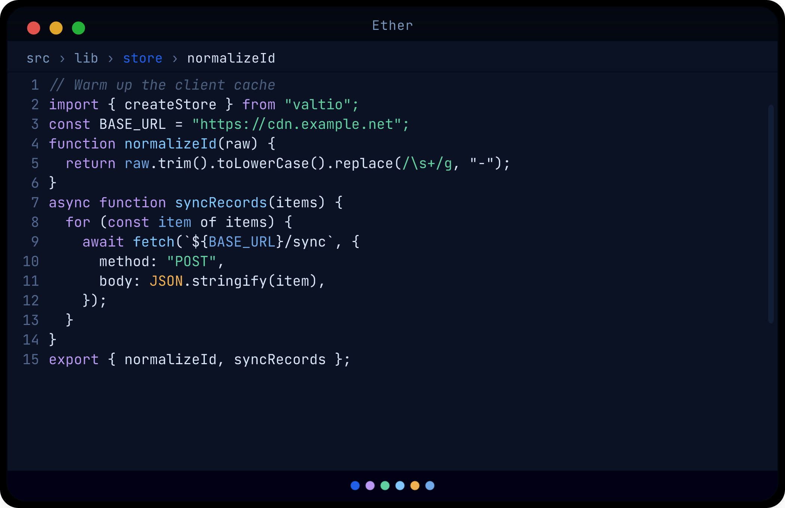
</div>
<div style="flex:0 1 420px;max-width:100%;box-sizing:border-box;margin:0 0 64px">
<p style="margin:0 0 10px;text-align:left;line-height:1.45">
<strong>Ether Sepia</strong>
</p>
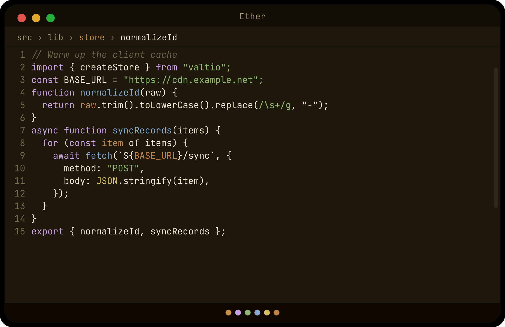
</div>
<div style="flex:0 1 420px;max-width:100%;box-sizing:border-box;margin:0 0 64px">
<p style="margin:0 0 10px;text-align:left;line-height:1.45">
<strong>Ether Slate</strong>
</p>

</div>
<div style="flex:0 1 420px;max-width:100%;box-sizing:border-box;margin:0 0 64px">
<p style="margin:0 0 10px;text-align:left;line-height:1.45">
<strong>Ether Stone</strong>
</p>

</div>
<div style="flex:0 1 420px;max-width:100%;box-sizing:border-box;margin:0 0 64px">
<p style="margin:0 0 10px;text-align:left;line-height:1.45">
<strong>Ether Storm</strong>
</p>

</div>
<div style="flex:0 1 420px;max-width:100%;box-sizing:border-box;margin:0 0 64px">
<p style="margin:0 0 10px;text-align:left;line-height:1.45">
<strong>Ether Wine</strong>
</p>
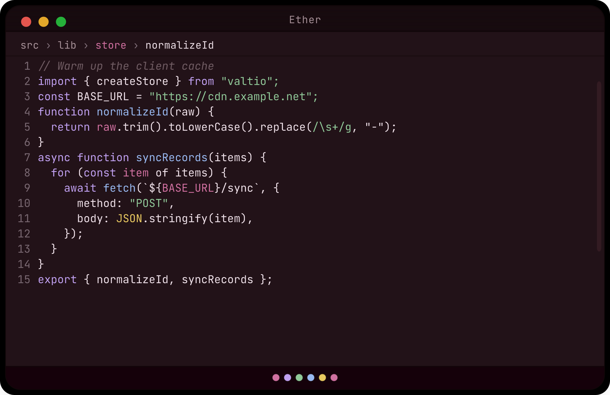
</div>
</div>
<!-- PREVIEW_GALLERY_END -->

## Snippets

**496** production-ready templates across six editor scopes. Type a prefix, press **Tab**.

📖 **[Snippet Documentation](https://PRIYAANK2510.github.io/ether-theme/snippets/)** — searchable reference for all 496 snippets with prefixes, categories, and code previews.

| Language    | File types            | Popular prefixes                                           |
| ----------- | --------------------- | ---------------------------------------------------------- |
| JavaScript  | `.js`, `.mjs`, `.cjs` | `fn`, `fetch`, `debounce`, `nodeexp`, `allsettled`         |
| TypeScript  | `.ts`                 | `interface`, `zsafe`, `satisfies`, `gfn`, `nodeenv`        |
| React (JSX) | `.jsx`                | `rfc`, `useoptimistic`, `tquse`, `nxpage`, `rfdialog`      |
| React (TSX) | `.tsx`                | `rfcserver`, `useformstatus`, `tqmut`, `nxaction`, `vtcmp` |
| HTML        | `.html`, `.htm`       | `html5`, `popover`, `jsonld`, `dialog`, `live`             |
| CSS         | `.css`                | `has`, `oklch`, `colormix`, `gridfit`, `modernreset`       |

**Stacks covered:** React 19 hooks · Next.js server actions &amp; routes · TanStack Query · Zod validation · Vitest &amp; Testing Library · MSW · Express &amp; Fastify · modern CSS (`:has()`, nesting, `color-mix`)

Regenerate the product site locally: `pnpm run site:build` (output in `site/`).

## Language support

Bundled TextMate grammars and **44 language associations** for modern web and Android projects.

| Grammar              | Extensions &amp; files                                                          |
| -------------------- | ------------------------------------------------------------------------------- |
| **Astro**            | `.astro` — frontmatter TypeScript, HTML, JSX expressions                        |
| **Vue**              | `.vue` — SFC template, script, style blocks                                     |
| **Svelte**           | `.svelte` — markup, script, style, directives                                   |
| **MDX**              | `.mdx` — Markdown + JSX                                                         |
| **Angular templates**| `{{ }}` bindings, `@if` / `@for` blocks in HTML &amp; inline TS templates      |
| **Kotlin**           | `.kt`, `.kts`, `build.gradle.kts` — Compose &amp; Android annotations           |
| **AIDL**             | `.aidl` — interfaces, parcelables, enums, unions                                |
| **ProGuard / R8**    | `.pro`, `.keep`, `proguard-rules.pro`, `consumer-rules.pro`                     |
| **Dotenv**           | `.env`, `.env.*`                                                                |

**Also associated:** `.jsx`, `.tsx`, `.js`, `.ts`, `AndroidManifest.xml`, `res/**` XML, Gradle files, and more. React / Preact use VS Code’s built-in JSX grammars with Ether theme colors.

## Contributing

```bash
git clone https://github.com/PRIYAANK2510/ether-theme.git
cd ether-theme
corepack enable
pnpm install
pnpm run check:fast   # daily: lint → extension build → tests → site prepare → typecheck → site build
```

| Task                   | Command            |
| ---------------------- | ------------------ |
| Extension rebuild loop | `pnpm run watch`    |
| Website dev server     | `pnpm run site:dev` |
| Full pre-release check | `pnpm run check`    |

See [CONTRIBUTING.md](CONTRIBUTING.md) for the full guide and [docs/WORKFLOW.md](docs/WORKFLOW.md) for release details.

**Enjoying Ether?** [Star the repo](https://github.com/PRIYAANK2510/ether-theme) — it helps other developers discover these themes.

## License

MIT — see [LICENSE](LICENSE).
