# Ether Themes

<p align="center">
  <strong>25 dark color themes · 496 web-dev snippets · Kotlin &amp; Android syntax highlighting</strong><br />
  One extension for <strong>VS Code</strong> and <strong>Cursor</strong> — WCAG-validated palettes, zero extra setup.
</p>

<p align="center">
  <a href="https://marketplace.visualstudio.com/items?itemName=Priyaank.ether-theme"></a>
  <a href="https://marketplace.visualstudio.com/items?itemName=Priyaank.ether-theme"></a>
  <a href="https://open-vsx.org/extension/PRIYAANK2510/ether-theme"></a>
  <a href="https://github.com/PRIYAANK2510/ether-theme/blob/main/LICENSE"></a>
</p>

<p align="center">
  <a href="https://marketplace.visualstudio.com/items?itemName=Priyaank.ether-theme"><strong>Install on VS Code</strong></a>
  &nbsp;·&nbsp;
  <a href="https://open-vsx.org/extension/PRIYAANK2510/ether-theme"><strong>Install on Cursor</strong></a>
  &nbsp;·&nbsp;
  <a href="https://github.com/PRIYAANK2510/ether-theme"><strong>GitHub</strong></a>
  &nbsp;·&nbsp;
  <a href="CHANGELOG.md"><strong>Changelog</strong></a>
</p>

---

## Install

1. Open **Extensions** (`Ctrl+Shift+X` / `Cmd+Shift+X`)
2. Search **`Ether Themes`**
3. Click **Install**, then pick a palette: **`Ctrl+K Ctrl+T`** (Windows/Linux) or **`Cmd+K Cmd+T`** (macOS)

Or run in the command palette:

```
ext install Priyaank.ether-theme
```

## Why developers pick Ether

- **25 dark themes** — Distinct palettes from navy-teal to warm stone, including Dracula-style and Catppuccin-style options
- **496 snippets** — React 19, Next.js App Router, TanStack Query, Zod, Vitest, Node/Express — type a prefix, press Tab
- **Built-in grammars** — Kotlin (`.kt`, `.kts`), ProGuard/R8, and Dotenv — no separate language extensions required
- **Readable by design** — WCAG contrast checks at build time; comments tuned to match active gutter line numbers
- **Works everywhere** — Published on the VS Code Marketplace and Open VSX for Cursor

## Theme catalog

| Theme | Character |
| --- | --- |
| Ether Aurora | Deep navy, electric teal |
| Ether Clay | Warm sumi ink, cinnabar |
| Ether Coral | Dusty rose, soft magenta |
| Ether Dracula | Charcoal, candy Dracula syntax |
| Ether Dusk | Plum twilight, rose accent |
| Ether Ember | Warm charcoal, copper |
| Ether Flame | Ember red-orange glow |
| Ether Frost | Arctic blue-gray frost |
| Ether Graphite | Pure neutral gray, steel blue |
| Ether Lichen | Forest floor, moss green |
| Ether Luna | Moonlit night, silver |
| Ether Mint | Cool mint-teal developer |
| Ether Mirage | Desert dusk, mirage cyan |
| Ether Mocha | Catppuccin-style cozy pastel |
| Ether Moss | Sage forest gray-green |
| Ether Noir | Near-monochrome noir |
| Ether Opal | Opalescent violet-gray |
| Ether Prism | Prism refraction, vivid syntax |
| Ether Sage | Muted sage green |
| Ether Sand | Warm parchment sand |
| Ether Slate | Atom-style gunmetal slate |
| Ether Stone | Terracotta warm stone |
| Ether Storm | Cool blue-gray slate |
| Ether Tide | Ocean tide teal |
| Ether Velvet | Velvet plum wine |

## Previews

High-DPI editor mockups — regenerated on `npm run build`.

<!-- PREVIEW_GALLERY_START -->
<div style="display:flex;flex-wrap:wrap;justify-content:center;align-items:flex-start;column-gap:48px;row-gap:0;max-width:100%">
<div style="flex:0 1 420px;max-width:100%;box-sizing:border-box;margin:0 0 64px">
<p style="margin:0 0 10px;text-align:left;line-height:1.45">
<strong>Ether Aurora</strong><br />
<em>Deep navy, electric teal</em>
</p>
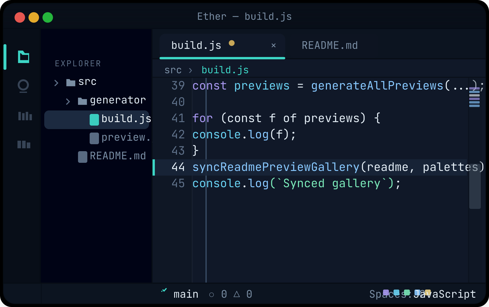
</div>
<div style="flex:0 1 420px;max-width:100%;box-sizing:border-box;margin:0 0 64px">
<p style="margin:0 0 10px;text-align:left;line-height:1.45">
<strong>Ether Clay</strong><br />
<em>Warm sumi ink, cinnabar</em>
</p>
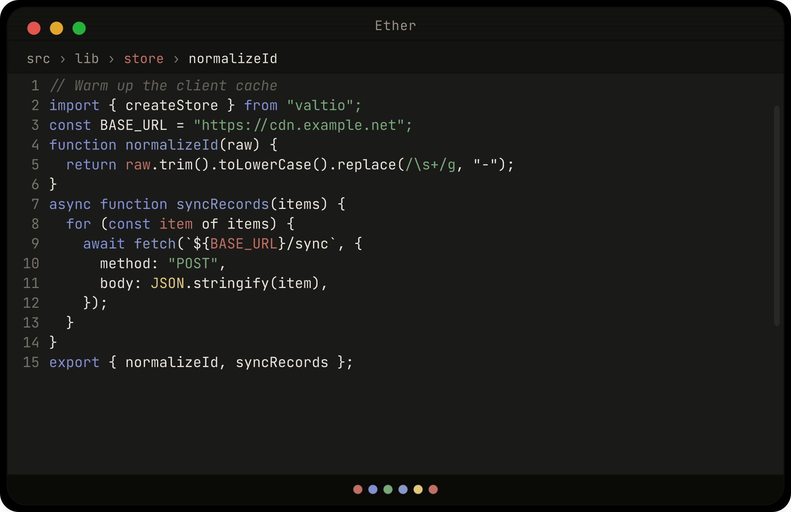
</div>
<div style="flex:0 1 420px;max-width:100%;box-sizing:border-box;margin:0 0 64px">
<p style="margin:0 0 10px;text-align:left;line-height:1.45">
<strong>Ether Coral</strong><br />
<em>Dusty rose, soft magenta</em>
</p>
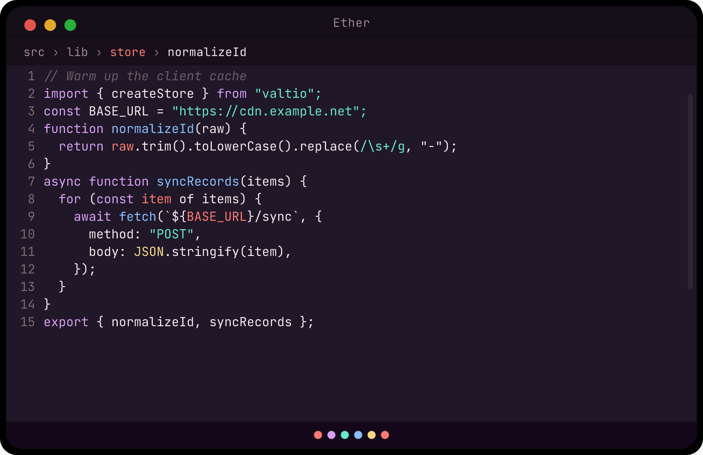
</div>
<div style="flex:0 1 420px;max-width:100%;box-sizing:border-box;margin:0 0 64px">
<p style="margin:0 0 10px;text-align:left;line-height:1.45">
<strong>Ether Dracula</strong><br />
<em>Charcoal, candy Dracula syntax</em>
</p>
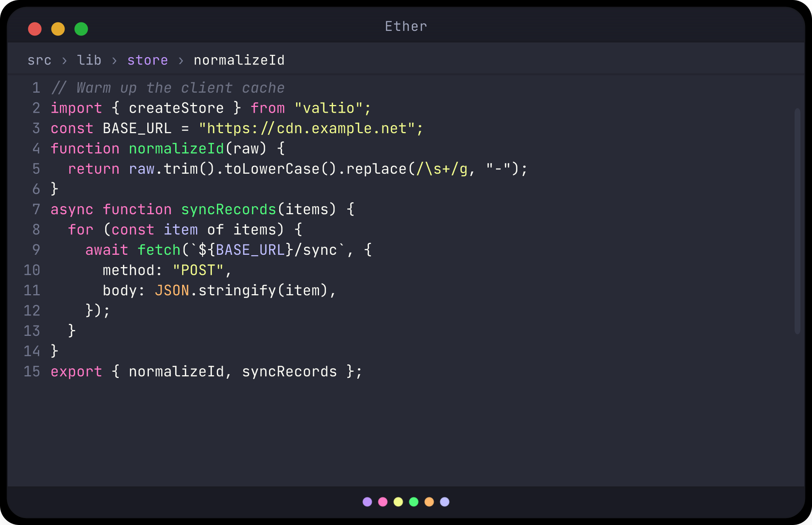
</div>
<div style="flex:0 1 420px;max-width:100%;box-sizing:border-box;margin:0 0 64px">
<p style="margin:0 0 10px;text-align:left;line-height:1.45">
<strong>Ether Dusk</strong><br />
<em>Plum twilight, rose accent</em>
</p>
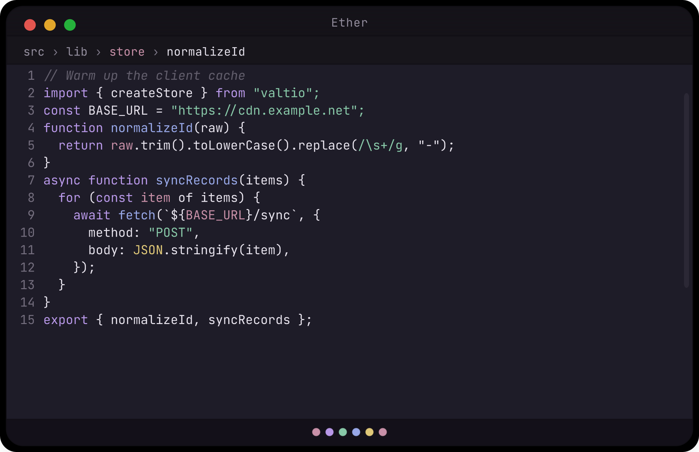
</div>
<div style="flex:0 1 420px;max-width:100%;box-sizing:border-box;margin:0 0 64px">
<p style="margin:0 0 10px;text-align:left;line-height:1.45">
<strong>Ether Ember</strong><br />
<em>Warm charcoal, copper</em>
</p>
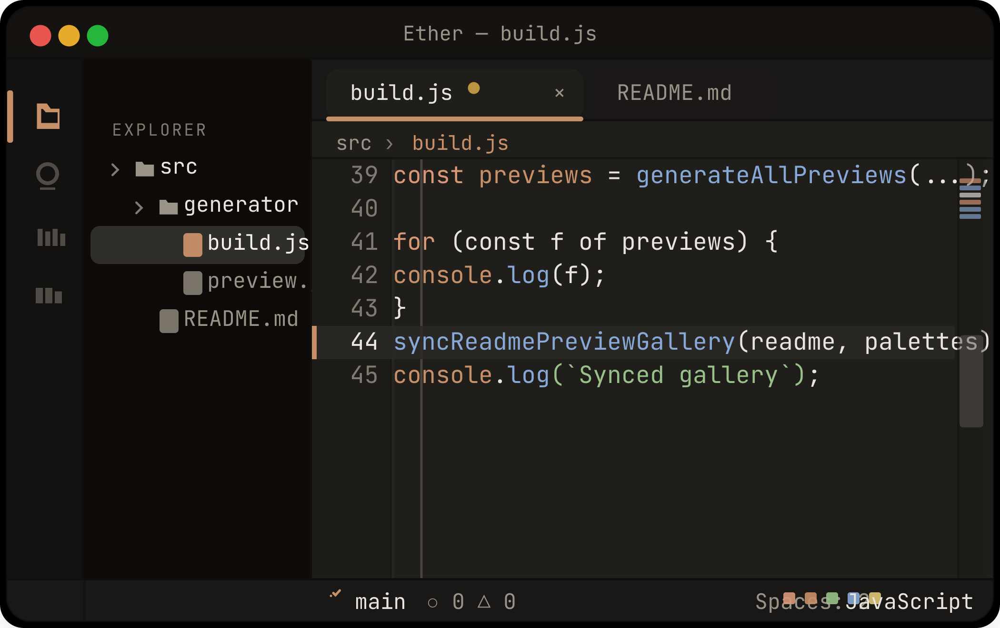
</div>
<div style="flex:0 1 420px;max-width:100%;box-sizing:border-box;margin:0 0 64px">
<p style="margin:0 0 10px;text-align:left;line-height:1.45">
<strong>Ether Flame</strong><br />
<em>Ember red-orange glow</em>
</p>
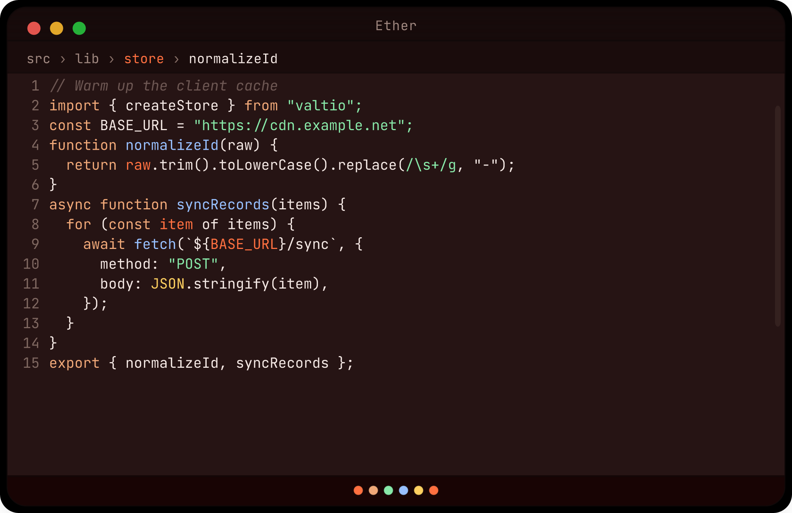
</div>
<div style="flex:0 1 420px;max-width:100%;box-sizing:border-box;margin:0 0 64px">
<p style="margin:0 0 10px;text-align:left;line-height:1.45">
<strong>Ether Frost</strong><br />
<em>Arctic blue-gray frost</em>
</p>
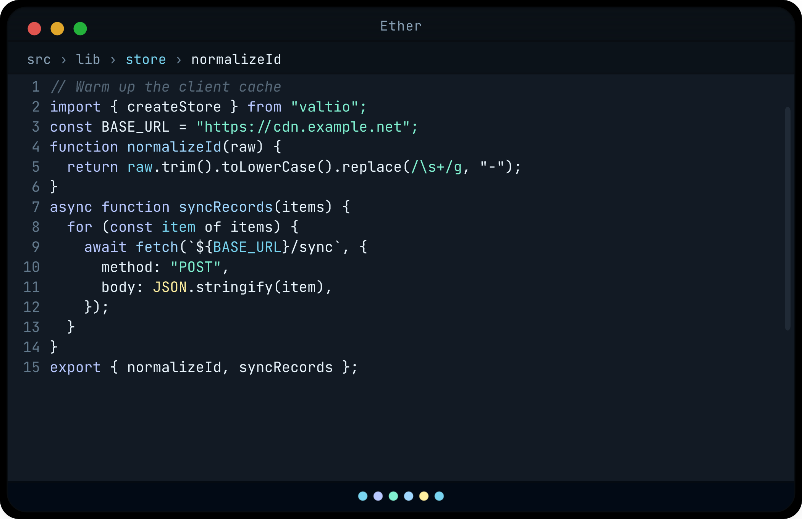
</div>
<div style="flex:0 1 420px;max-width:100%;box-sizing:border-box;margin:0 0 64px">
<p style="margin:0 0 10px;text-align:left;line-height:1.45">
<strong>Ether Graphite</strong><br />
<em>Pure neutral gray, steel blue</em>
</p>
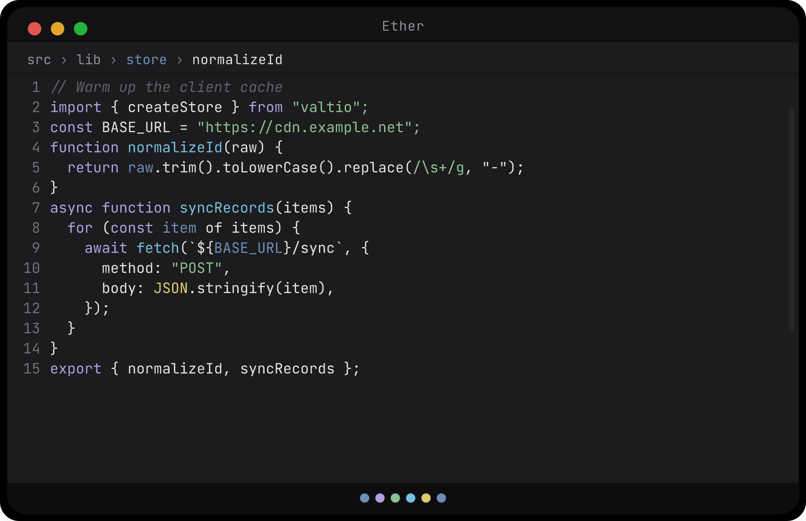
</div>
<div style="flex:0 1 420px;max-width:100%;box-sizing:border-box;margin:0 0 64px">
<p style="margin:0 0 10px;text-align:left;line-height:1.45">
<strong>Ether Lichen</strong><br />
<em>Forest floor, moss green</em>
</p>
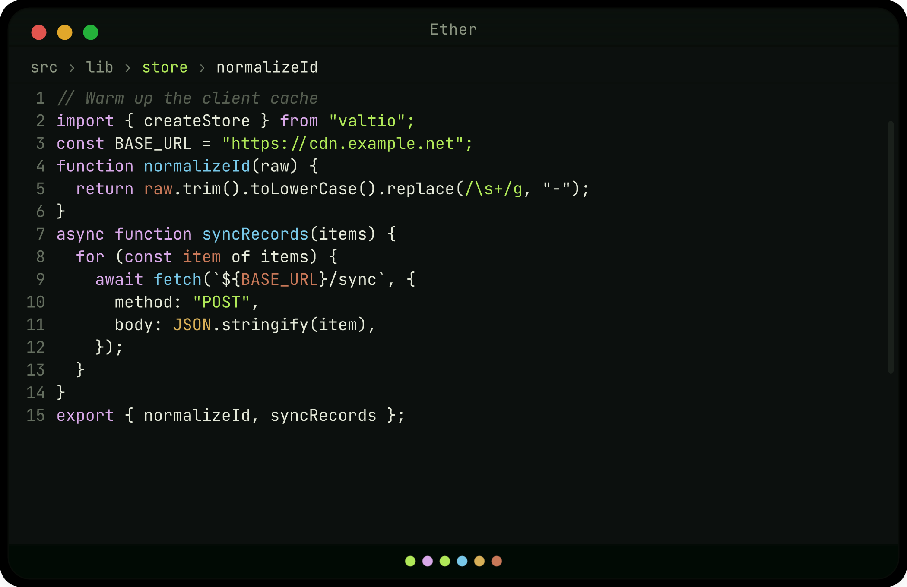
</div>
<div style="flex:0 1 420px;max-width:100%;box-sizing:border-box;margin:0 0 64px">
<p style="margin:0 0 10px;text-align:left;line-height:1.45">
<strong>Ether Luna</strong><br />
<em>Moonlit night, silver</em>
</p>
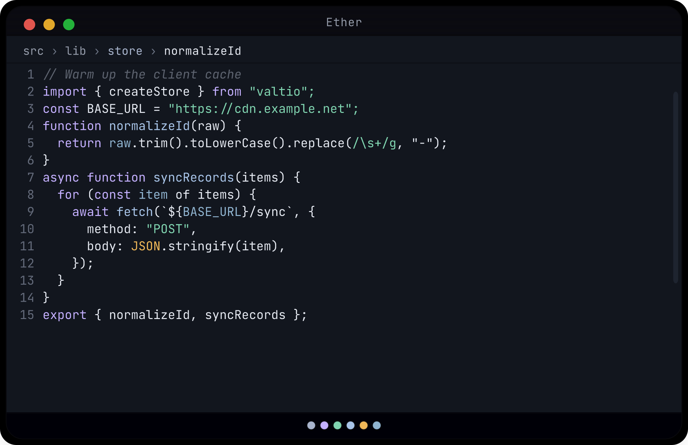
</div>
<div style="flex:0 1 420px;max-width:100%;box-sizing:border-box;margin:0 0 64px">
<p style="margin:0 0 10px;text-align:left;line-height:1.45">
<strong>Ether Mint</strong><br />
<em>Cool mint-teal developer</em>
</p>
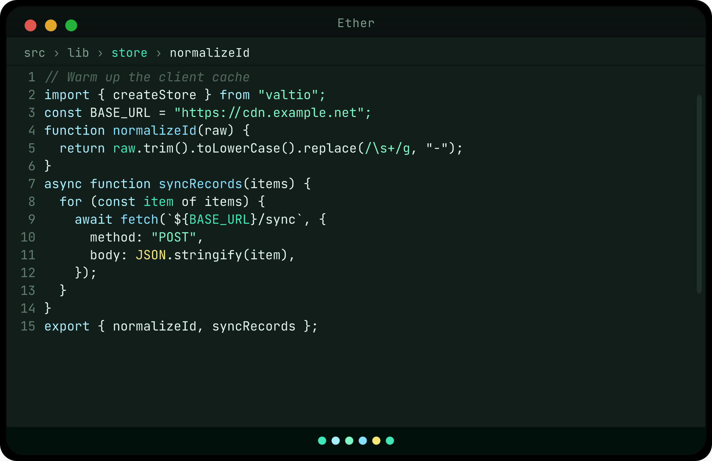
</div>
<div style="flex:0 1 420px;max-width:100%;box-sizing:border-box;margin:0 0 64px">
<p style="margin:0 0 10px;text-align:left;line-height:1.45">
<strong>Ether Mirage</strong><br />
<em>Desert dusk, mirage cyan</em>
</p>
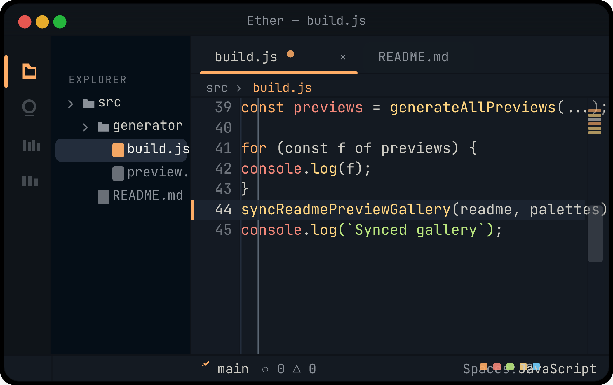
</div>
<div style="flex:0 1 420px;max-width:100%;box-sizing:border-box;margin:0 0 64px">
<p style="margin:0 0 10px;text-align:left;line-height:1.45">
<strong>Ether Mocha</strong><br />
<em>Catppuccin-style cozy pastel</em>
</p>
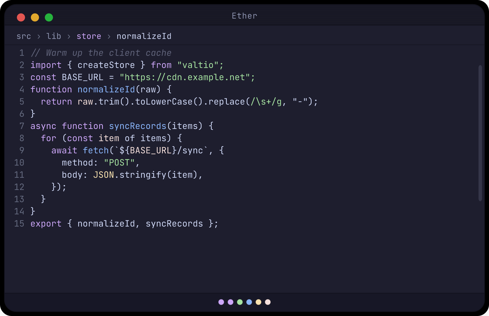
</div>
<div style="flex:0 1 420px;max-width:100%;box-sizing:border-box;margin:0 0 64px">
<p style="margin:0 0 10px;text-align:left;line-height:1.45">
<strong>Ether Moss</strong><br />
<em>Sage forest gray-green</em>
</p>
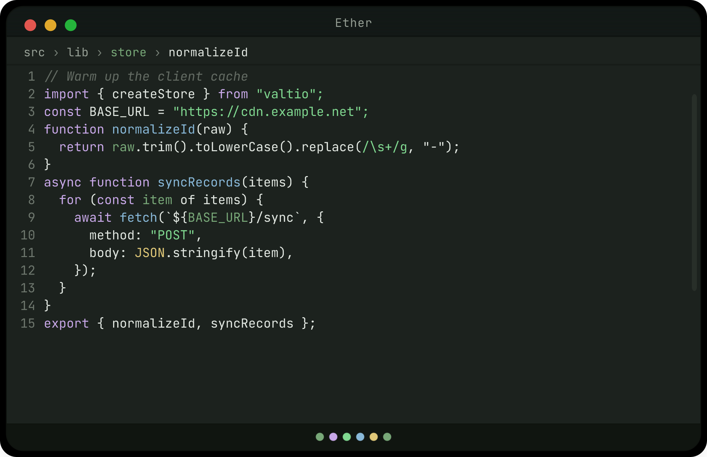
</div>
<div style="flex:0 1 420px;max-width:100%;box-sizing:border-box;margin:0 0 64px">
<p style="margin:0 0 10px;text-align:left;line-height:1.45">
<strong>Ether Noir</strong><br />
<em>Near-monochrome noir</em>
</p>
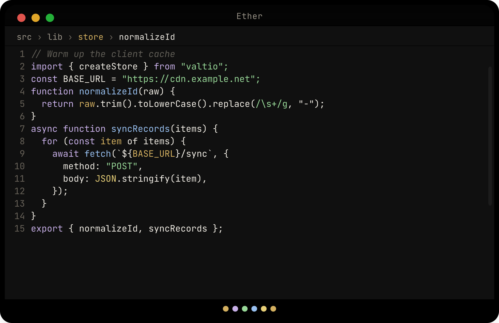
</div>
<div style="flex:0 1 420px;max-width:100%;box-sizing:border-box;margin:0 0 64px">
<p style="margin:0 0 10px;text-align:left;line-height:1.45">
<strong>Ether Opal</strong><br />
<em>Opalescent violet-gray</em>
</p>
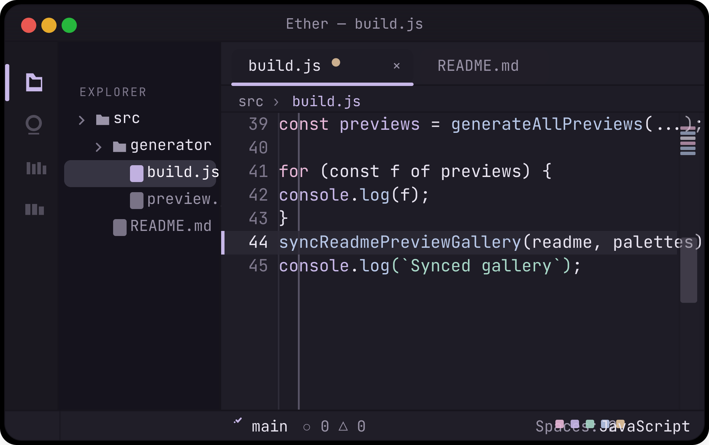
</div>
<div style="flex:0 1 420px;max-width:100%;box-sizing:border-box;margin:0 0 64px">
<p style="margin:0 0 10px;text-align:left;line-height:1.45">
<strong>Ether Prism</strong><br />
<em>Prism refraction, vivid syntax</em>
</p>
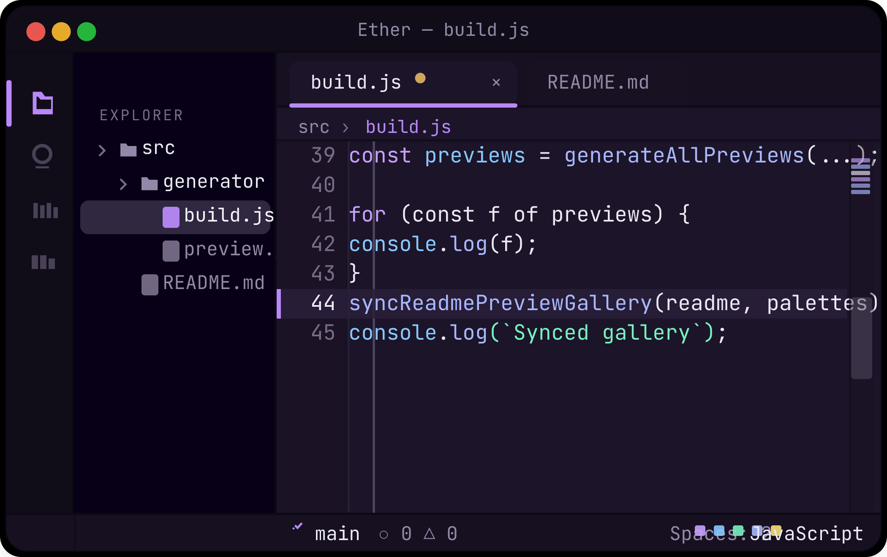
</div>
<div style="flex:0 1 420px;max-width:100%;box-sizing:border-box;margin:0 0 64px">
<p style="margin:0 0 10px;text-align:left;line-height:1.45">
<strong>Ether Sage</strong><br />
<em>Muted sage green</em>
</p>
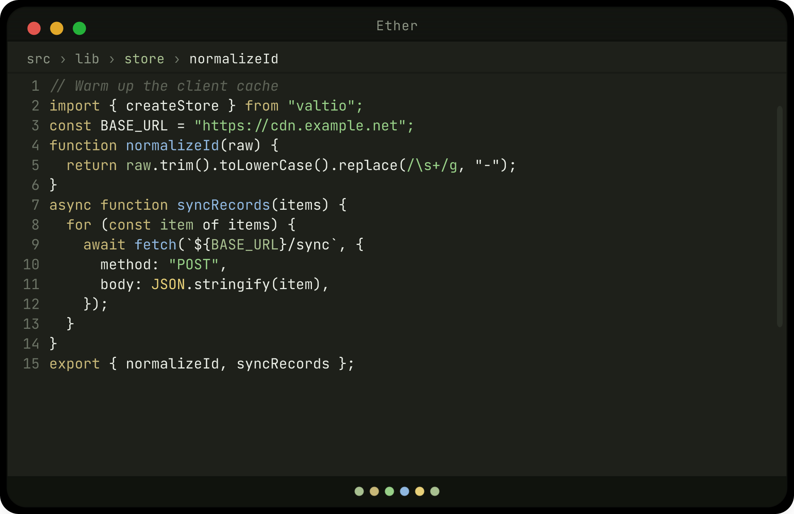
</div>
<div style="flex:0 1 420px;max-width:100%;box-sizing:border-box;margin:0 0 64px">
<p style="margin:0 0 10px;text-align:left;line-height:1.45">
<strong>Ether Sand</strong><br />
<em>Warm parchment sand</em>
</p>
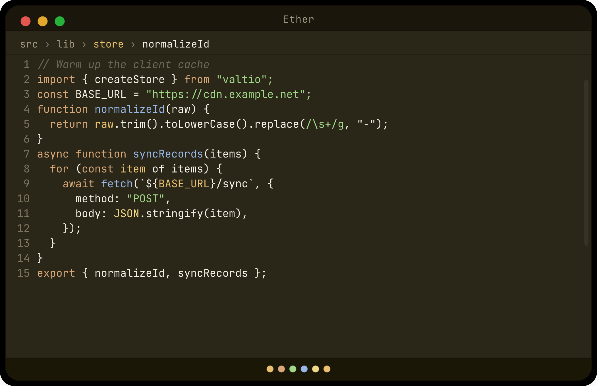
</div>
<div style="flex:0 1 420px;max-width:100%;box-sizing:border-box;margin:0 0 64px">
<p style="margin:0 0 10px;text-align:left;line-height:1.45">
<strong>Ether Slate</strong><br />
<em>Atom-style gunmetal slate</em>
</p>
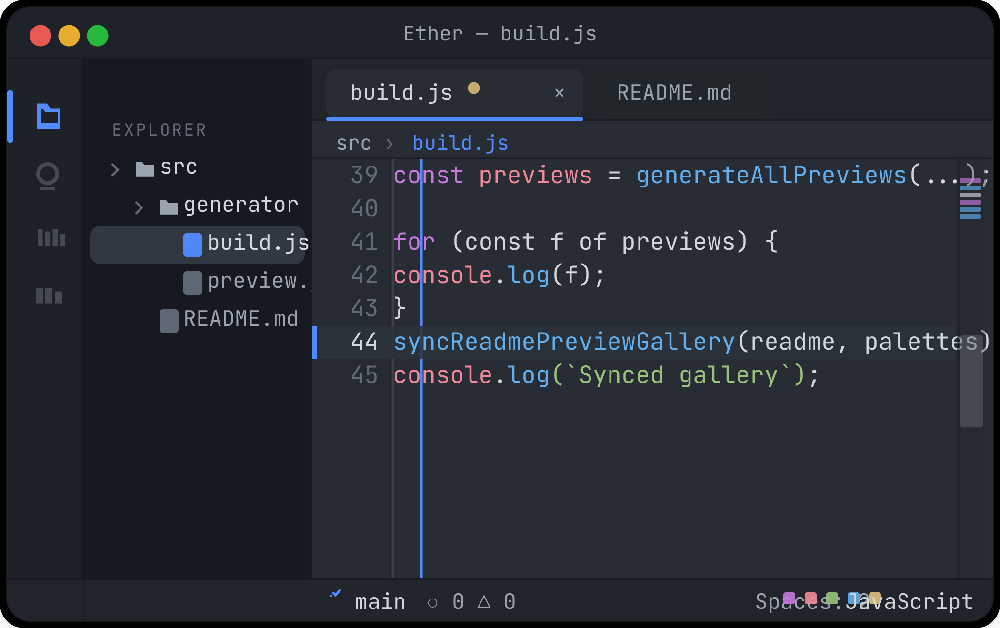
</div>
<div style="flex:0 1 420px;max-width:100%;box-sizing:border-box;margin:0 0 64px">
<p style="margin:0 0 10px;text-align:left;line-height:1.45">
<strong>Ether Stone</strong><br />
<em>Terracotta warm stone</em>
</p>
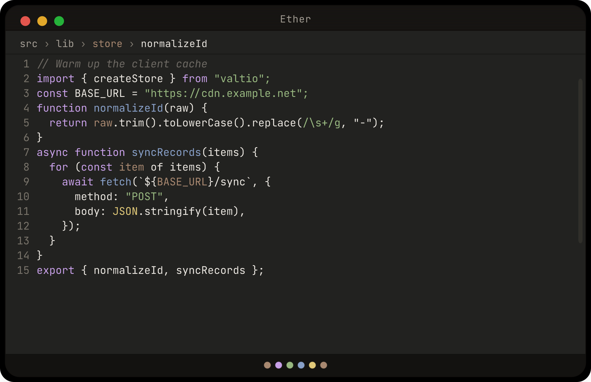
</div>
<div style="flex:0 1 420px;max-width:100%;box-sizing:border-box;margin:0 0 64px">
<p style="margin:0 0 10px;text-align:left;line-height:1.45">
<strong>Ether Storm</strong><br />
<em>Cool blue-gray slate</em>
</p>
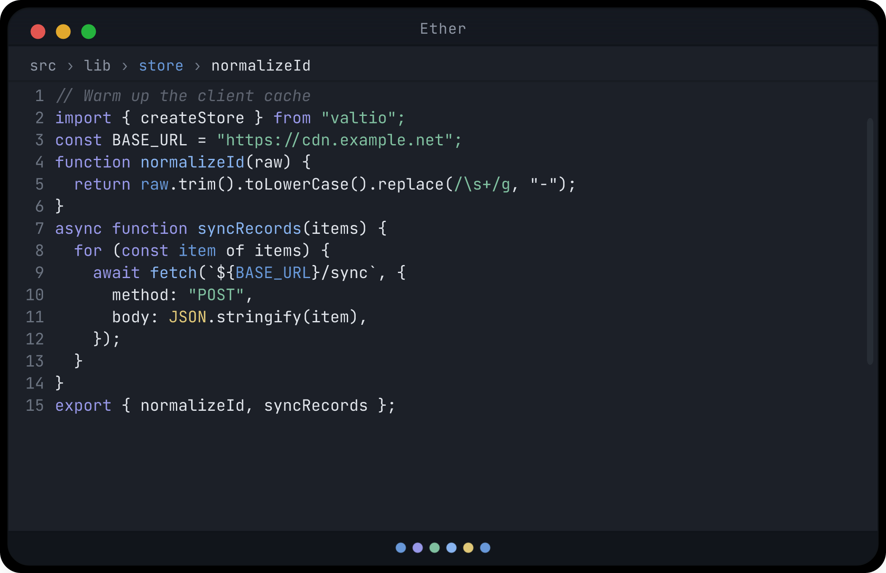
</div>
<div style="flex:0 1 420px;max-width:100%;box-sizing:border-box;margin:0 0 64px">
<p style="margin:0 0 10px;text-align:left;line-height:1.45">
<strong>Ether Tide</strong><br />
<em>Ocean tide teal</em>
</p>
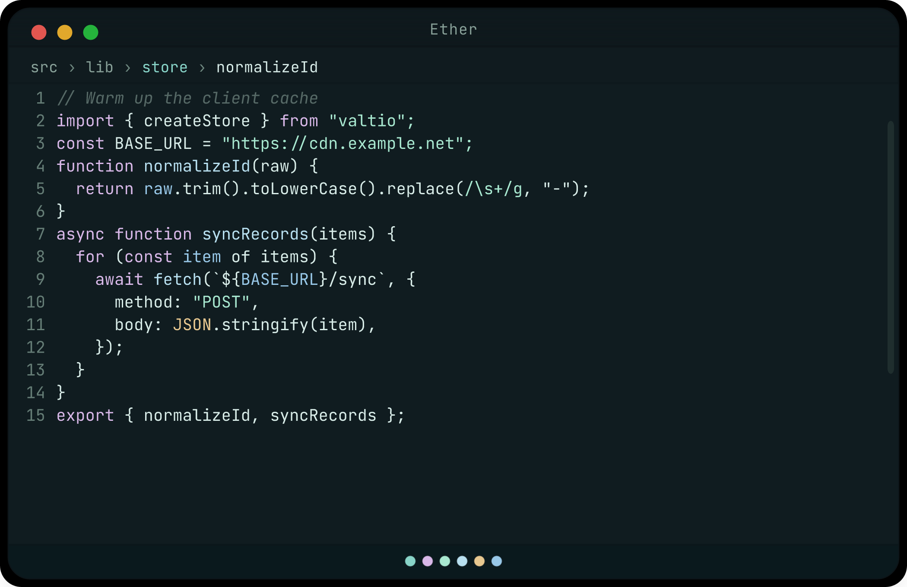
</div>
<div style="flex:0 1 420px;max-width:100%;box-sizing:border-box;margin:0 0 64px">
<p style="margin:0 0 10px;text-align:left;line-height:1.45">
<strong>Ether Velvet</strong><br />
<em>Velvet plum wine</em>
</p>
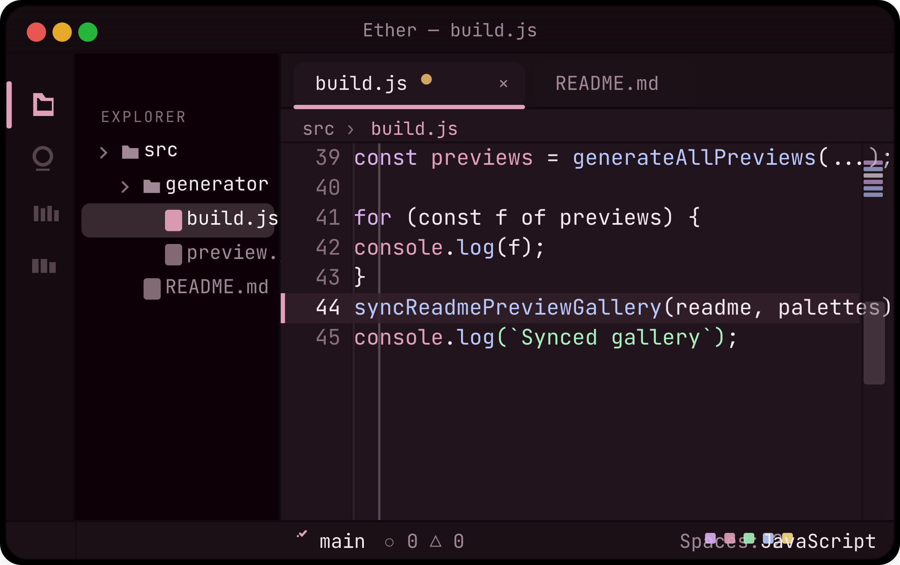
</div>
</div>
<!-- PREVIEW_GALLERY_END -->

## Snippets

**496** production-ready templates across six editor scopes. Type a prefix, press **Tab**.

| Language | File types | Popular prefixes |
| --- | --- | --- |
| JavaScript | `.js`, `.mjs`, `.cjs` | `fn`, `fetch`, `debounce`, `nodeexp`, `allsettled` |
| TypeScript | `.ts` | `interface`, `zsafe`, `satisfies`, `gfn`, `nodeenv` |
| React (JSX) | `.jsx` | `rfc`, `useoptimistic`, `tquse`, `nxpage`, `rfdialog` |
| React (TSX) | `.tsx` | `rfcserver`, `useformstatus`, `tqmut`, `nxaction`, `vtcmp` |
| HTML | `.html`, `.htm` | `html5`, `popover`, `jsonld`, `dialog`, `live` |
| CSS | `.css` | `has`, `oklch`, `colormix`, `gridfit`, `modernreset` |

**Stacks covered:** React 19 hooks · Next.js server actions &amp; routes · TanStack Query · Zod validation · Vitest &amp; Testing Library · MSW · Express &amp; Fastify · modern CSS (`:has()`, nesting, `color-mix`)

## Language support

Bundled TextMate grammars and **37 file associations** for Android, JVM, and everyday config files.

| Grammar | Extensions |
| --- | --- |
| **Kotlin** | `.kt`, `.kts`, `*.gradle.kts` |
| **ProGuard / R8** | `.pro`, `.keep` |
| **Dotenv** | `.env`, `.env.*` |

Also maps Groovy Gradle scripts, Java AIDL, properties, YAML, Docker, Makefile, and more to built-in VS Code languages.

## Contributing

```bash
git clone https://github.com/PRIYAANK2510/ether-theme.git
cd ether-theme
npm install
npm run check   # lint + test + build
```

Palette sources live in `src/palettes/`. See [docs/WORKFLOW.md](docs/WORKFLOW.md) for release details.

**Enjoying Ether?** [Star the repo](https://github.com/PRIYAANK2510/ether-theme) — it helps other developers discover these themes.

## License

MIT — see [LICENSE](LICENSE).
